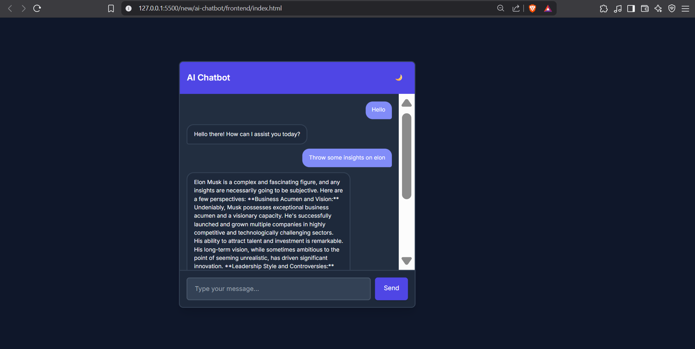

# 🤖 AI-Powered Chatbot

An intelligent chatbot powered by Google Gemini, with semantic memory using Pinecone and persistent chat history in MongoDB. Built with Node.js and styled with Tailwind CSS.

---
<p align="center">
  
</p>

---

## 🚀 Features

- 💬 **Smart Conversations** – Powered by **Google Gemini Pro API**
- 🧠 **Context-Aware** – Uses **Pinecone** for semantic memory via vector search
- 🗂 **Persistent History** – Chats stored in **MongoDB Atlas**
- 🎨 **Modern UI** – Clean interface with **Tailwind CSS**
- 🌗 **Theme Support** – Light/Dark mode toggle
- 🧱 **Modular Architecture** – Easy to maintain and scale

---

## 🛠 Tech Stack

### 🔹 Frontend
- HTML5
- Tailwind CSS
- Vanilla JavaScript

### 🔸 Backend
- Node.js
- Express.js

### 🧠 AI & Data
- Google Gemini API
- Pinecone (Vector DB)
- MongoDB Atlas (Document DB)

---

## 📦 Installation

### ✅ Prerequisites

- Node.js v18+
- MongoDB Atlas account
- Google Gemini API Key
- Pinecone account and API Key

---

### 🔧 Setup Instructions

```bash
# 1. Clone the repository
git clone https://github.com/0Raghav-Sharma0/ai-chatbot.git
cd ai-chatbot

# 2. Install backend dependencies
cd backend
npm install
```

### 📁 Create `.env` file inside `backend/`

```env
MONGO_URL=your_mongodb_atlas_connection_string
PORT=5000
GEMINI_API_KEY=your_google_gemini_api_key
PINECONE_API_KEY=your_pinecone_api_key
PINECONE_ENVIRONMENT=your_pinecone_env
PINECONE_INDEX_NAME=your_pinecone_index_name
```

### ▶️ Start the backend server

```bash
node server.js
```

### 🖥 Launch the frontend

```bash
# Open the HTML file in your browser
open frontend/index.html    # (macOS)
# or
start frontend/index.html   # (Windows)
# or
xdg-open frontend/index.html  # (Linux)
```

---

## 🏗 Project Structure

```
ai-chatbot/
├── backend/
│   ├── models/            # MongoDB schemas
│   ├── routes/            # Express routes
│   ├── utils/             # Helper functions (e.g. Gemini, Pinecone)
│   ├── server.js          # Main server entry point
│   └── .env               # Environment config
│
├── frontend/
│   ├── index.html         # Chat UI
│   └── script.js          # Client-side logic
│
├── public/
│   └── images/
│       └── Screenshot 2025-05-20 033836.png
│
└── README.md
```

---

## 📬 API Endpoint

```
POST /api/chat
Request Body:
{
  "text": "Your message",
  "userId": "user-12345"
}

Response:
{
  "reply": "AI-generated response"
}
```

---

## ✨ Credits

Developed by [Raghav Sharma](https://github.com/0Raghav-Sharma0) – IIIT Sonepat

---

## LICENSE

This project is licensed under the [MIT License](./ai-chatbot/LICENSE).
